<div align="center">


[](https://github.com/prageeth-thilakarathna)

</div>

---

## `> whoami`

```java
public class Prageeth extends SoftwareEngineer {

    private final String focus     = "Backend Architecture · IoT Engineering · AI-Driven Systems";
    private final String currently = "Associate Software Engineer @ SimpliFy Labs";
    private final String degree    = "BEng (Hons) Software Engineering — London Metropolitan University (2027)";
    private final String location  = "Sri Lanka 🇱🇰";

    @Override
    public String getPhilosophy() {
        return "I gravitate toward technical depth — JVM internals, distributed event pipelines, " +
               "real-time MQTT ecosystems, and embedded firmware — over surface-level CRUD.";
    }
}
```

> 💡 **I specialize in systems that work at the edges** — backend infrastructure that handles real hardware, real-time data, and real architectural constraints. I prefer engineering complexity that matters.

---

## 🛠️ Technology Arsenal

### ⚙️ Backend & Architecture


### 📡 IoT & Embedded Systems


### 🗄️ Databases


### ☁️ Cloud & DevOps


### 🤖 AI & Data


### 🎨 Frontend


---

## 🚀 Featured Projects

<table>
<tr>
<td width="50%" valign="top">

### ⚡ CeyGo — IoT Scooter Ecosystem

`Spring Boot` `React` `MQTT` `AWS EC2` `Android`

End-to-end micro-mobility platform built for real hardware and real users. Engineered sub-second MQTT bi-directional communication between server and scooter firmware, dynamic pricing algorithms with automatic model switching, geofence violation detection, and automated Stripe payment processing.

**Impact:** First full AWS deployment; resolved critical BLE & networking bottlenecks across live fleet.

</td>
<td width="50%" valign="top">

### 🤖 TaproBot — AI Virtual Travel Assistant _(New)_

`Spring Boot` `React` `MySQL` `Apache OpenNLP` `Azure VM`

Enterprise-grade NLP-powered chatbot engineered for Sri Lankan tourism. Features an embedded Maximum Entropy classifier engine with a `0.65` confidence boundary, predictive risk advisory DTOs, and a Human-In-The-Loop (HITL) feedback loop for hot-reloading classifier weights into JVM memory — no restarts required.

**Stack:** 3-tier monorepo architecture deployed on Azure VM.

</td>
</tr>
<tr>
<td width="50%" valign="top">

### 🚢 Trackr — Freight Trading Platform

`Node.js` `Angular` `Firebase`

Specialized B2B reverse-bidding system for the dry bulk shipping industry. Digitizes cargo chartering with real-time auction and negotiation flows. Spearheaded full system recovery — reverse-engineered and redeployed a dormant legacy codebase to Firebase, authored the deployment guide, and executed a clean external team handover.

</td>
<td width="50%" valign="top">

### 🏥 Mastery Med — AMC Flashcards

`Flutter` `Spring Boot` `MySQL`

Cross-platform medical exam preparation app live on the Google Play Store for Australian Medical Council candidates. Managed the complete Play Store release lifecycle including mandatory 14-day closed testing and a critical Android Target API upgrade.

</td>
</tr>
<tr>
<td width="50%" valign="top">

### 🏋️ AI Fitness Platform _(R&D / Architectural Phase)_

`Spring Boot` `React Native` `TensorFlow`

Holistic wellness ecosystem designed around AI Pose Estimation for real-time exercise form correction and personalized workout plans. Led full system architecture — ERD, SRS, and technical feasibility studies for TensorFlow model integration.

</td>
<td width="50%" valign="top">

### 📦 More on GitHub...

Explore my repositories for smaller experiments across embedded firmware (MicroPython / C), backend microservice prototypes, and DevOps configuration work.

[](https://github.com/prageeth-thilakarathna)

</td>
</tr>
</table>

---

## 📊 GitHub Stats

<div align="center">



<br/><br/>


&nbsp;&nbsp;


<br/><br/>


</div>

---

## 🤝 Connect With Me

<div align="center">

[](https://linkedin.com/in/prageeth-thilakarathna)
[](https://dev.to/prageeth_thilakarathna)
[](https://medium.com/@prageeth_thilakarathna)
[](https://x.com/pcthilakarathna)
[](https://www.hackerrank.com/profile/yg_prageeth_001)
[](mailto:ygprageeththilakarathna@gmail.com)

</div>

---

<div align="center">


_"Build systems that are honest about their complexity — then engineer them to handle it gracefully."_

</div>
